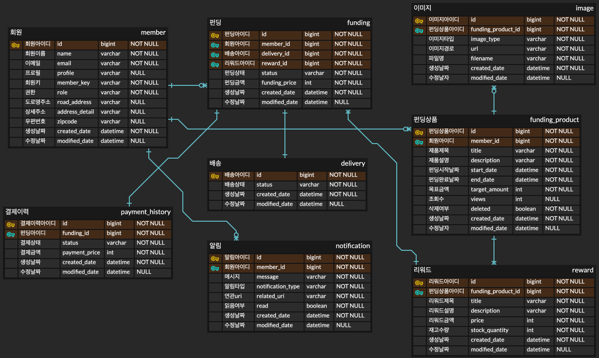
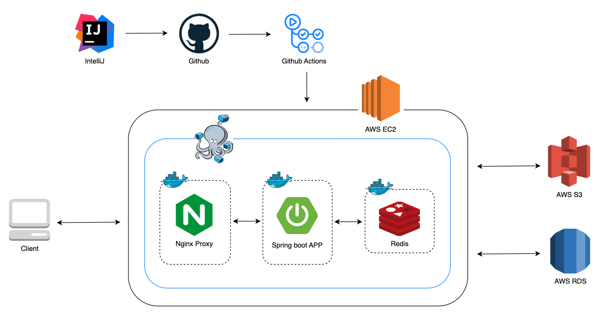

# 제품 펀딩 서비스
와디즈, 텀블벅과 같은 제품 한정 크라우드 펀딩 서비스입니다.

## 프로젝트 기능 및 설계
- 회원가입 및 로그인
  - 소셜 로그인(구글, 카카오)을 통해 회원가입 및 로그인 할 수 있습니다.
  - 이미 가입된 유저라면 자동 로그인 됩니다.
  - 새로운 유저라면 유저 정보 등록 후 로그인 됩니다.
  - 일반 유저로만 가입됩니다.
    - 관리자 role도 있지만, 이는 별도의 API로는 제공하지 않습니다.
  - 로그인에 성공하게 되면 JWT를 발급합니다.
  - 소셜 로그인에 실패하게 되면 인증 에러가 발생합니다.
- 회원 정보 수정 및 탈퇴
  - 로그인한 유저만 수정할 수 있습니다.
  - 탈퇴는 따로 제공하지 않습니다. 해당 소셜에서 연결 제거 바랍니다.
- 펀딩 상품 목록 조회
  - 로그인하지 않아도 펀딩 상품 목록을 조회할 수 있습니다.
  - 조회순 / 최신순(기본값)으로 정렬할 수 있습니다.
  - 펀딩 상태에 따라 필터링할 수 있습니다.
    - 오픈예정 / 진행중
- 펀딩 상품 등록
  - 로그인한 유저만 상품을 등록할 수 있습니다.
  - 제목(50자), 설명(100자), 썸네일 이미지(한 장), 디테일 이미지(5장 이내)로 업로드 가능합니다.
- 펀딩 상품 수정 및 삭제
  - 로그인한 유저이고, 상품을 등록한 유저만 수정 및 삭제할 수 있습니다.
  - 펀딩 상품이 오픈 전인 상태일 때만 수정 및 삭제할 수 있습니다.
- 펀딩 상품 상세
  - 로그인하지 않아도 펀딩 상품 상세를 조회할 수 있습니다.
  - 남은 날짜, 달성 퍼센트, 모인 금액, 후원자수, 조회수를 확인할 수 있습니다.
- 펀딩하기
  - 로그인한 유저만 펀딩할 수 있습니다.
  - 선택한 리워드 금액만큼 결제되며, 한번에 하나의 리워드만 선택할 수 있습니다.
  - 모든 리워드는 수량이 정해져있으며 선착순입니다.
  - 펀딩 기간 완료 후 목표 금액 달성에 실패하면 자동으로 결제가 취소됩니다.
    - 결제 관련 API는 제공하지 않습니다.
  - 펀딩에 성공하면 배송이 시작됩니다.
- 참여한 펀딩 목록 조회
  - 로그인한 유저만 가능합니다.
  - 기간별(한단 단위)로 조회 가능합니다.
  - 펀딩 정보와 상태를 확인할 수 있습니다.
    - 진행중 / 완료 / 실패
- 펀딩 상품 알림
  - 펀딩한 상품의 기한 종료 시 성공/실패에 대한 알림이 발송됩니다.
  - 읽지 않은 알림 내역을 조회할 수 있습니다.
  - 상세 조회 시 연관 링크로 리다이렉트 됩니다.

## ERD

## Server Architecture

## Troubleshooting
[go to the troubleshooting section](doc/trouble_shooting.md)

## Tech Stack
- Java 17
- Spring Boot 3.1.6
- Spring Security
- Spring Batch
- Spring data JPA
- Querydsl
- MySQL database
- Redis
- AWS S3
